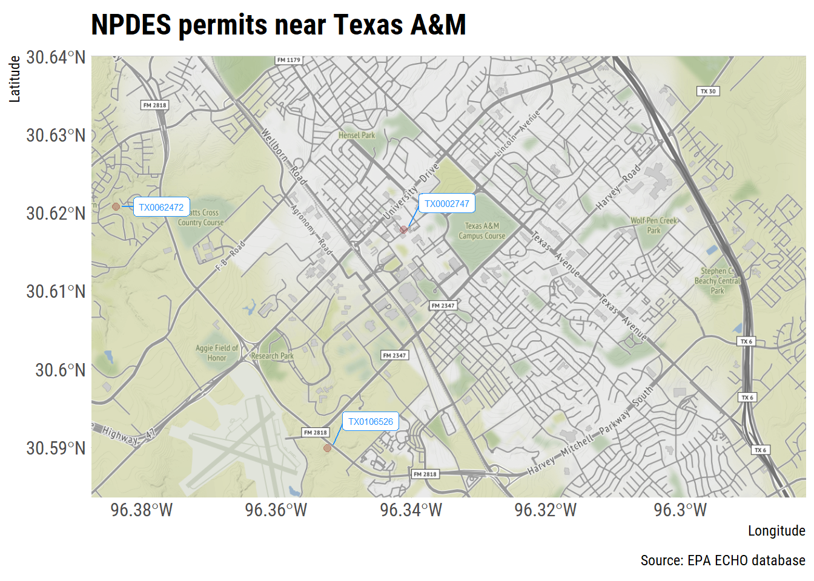
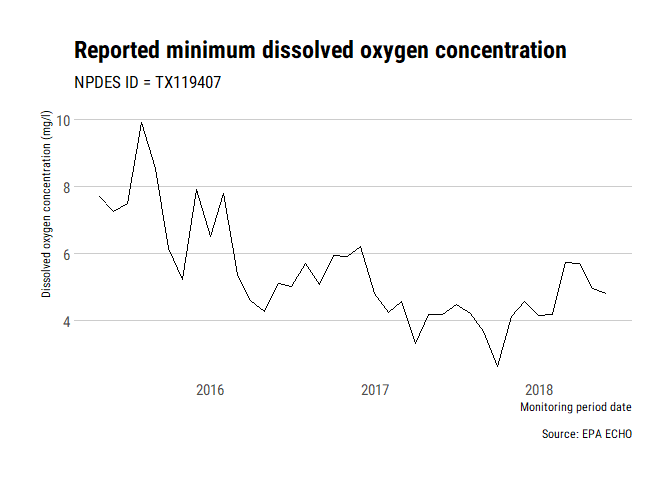

<!-- README.md is generated from README.Rmd. Please edit that file -->

# echor

[](https://cran.r-project.org/package=echor)

[](https://travis-ci.org/mps9506/echor)
[](https://ci.appveyor.com/project/mps9506/echor)
[](https://codecov.io/github/mps9506/echor?branch=master)

## Overview

echor downloads wastewater discharge and air emission data for EPA
permitted facilities using the [EPA ECHO API](https://echo.epa.gov/).

## Installation

echor is on CRAN:

``` r
install.packages("echor")
```

Or install the development version from github:

``` r
devtools::install_github("mps9506/echor")
```

## Usage

[Getting
started](https://mps9506.github.io/echor/articles/introduction.html)

[Functions](https://mps9506.github.io/echor/reference/index.html)

## Examples

### Download information about facilities with an NPDES permit

We can look up plants by permit id, bounding box, and numerous other
parameters. I plan on providing documentation of available parameters.
However, arguments can be looked up here:
[get\_cwa\_rest\_services\_get\_facility\_info](https://echo.epa.gov/tools/web-services/facility-search-water#!/Facility_Information/get_cwa_rest_services_get_facility_info)

``` r
library(tidyverse)
library(echor)

## echoWaterGetFacilityInfo() will return a dataframe or simple features (sf) dataframe.

df <- echoWaterGetFacilityInfo(output = "df", 
                               xmin = '-96.387509', 
                               ymin = '30.583572', 
                               xmax = '-96.281422', 
                               ymax = '30.640008',
                               p_ptype = "NPD")

head(df)
#> # A tibble: 3 x 26
#>   CWPName SourceID CWPStreet CWPCity CWPState CWPStateDistrict CWPZip
#>   <chr>   <chr>    <chr>     <chr>   <chr>    <chr>            <chr> 
#> 1 CENTRA~ TX00027~ 222 IREL~ COLLEG~ TX       09               77843 
#> 2 HEAT T~ TX01065~ 0.25MI S~ COLLEG~ TX       09               77845 
#> 3 TURKEY~ TX00624~ 3000FT W~ BRYAN   TX       09               77807 
#> # ... with 19 more variables: MasterExternalPermitNmbr <chr>, RegistryID <chr>,
#> #   CWPCounty <chr>, CWPEPARegion <chr>, FacDerivedHuc <chr>, FacLat <dbl>,
#> #   FacLong <dbl>, CWPTotalDesignFlowNmbr <dbl>,
#> #   CWPActualAverageFlowNmbr <dbl>, DschToMs4 <chr>, ExposedActivity <chr>,
#> #   Subsector <chr>, CWPVersionNmbr <dbl>, SubmittedDate <date>,
#> #   CWPPermitTypeDesc <chr>, CWPIssueDate <date>, CWPTerminationDate <date>,
#> #   CWPSNCStatus <chr>, CWPCsoOutfalls <dbl>
```

The ECHO database can provide over 270 different columns. echor returns
a subset of these columns that should work for most users. However, you
can specify what data you want returned. Use `echoWaterGetMeta()` to
return a dataframe with column numbers, names, and descriptions to
identify the columns you want returned. Then include the column numbers
as a comma separated string in the `qcolumns` argument. In the example
below, the `qcolumns` argument indicates the dataframe will include
plant name, 8-digit HUC, latitude, longitude, and total design flow.

``` r
df <- echoWaterGetFacilityInfo(output = "df", 
                               xmin = '-96.387509', 
                               ymin = '30.583572', 
                               xmax = '-96.281422', 
                               ymax = '30.640008',
                               qcolumns = '1,14,23,24,25',
                               p_ptype = "NPD")
head(df)
#> # A tibble: 3 x 6
#>   CWPName            SourceID  FacDerivedHuc FacLat FacLong CWPTotalDesignFlowN~
#>   <chr>              <chr>     <chr>          <dbl>   <dbl>                <dbl>
#> 1 CENTRAL UTILITY P~ TX0002747 12070103        30.6   -96.3                 0.93
#> 2 HEAT TRANSFER RES~ TX0106526 12070101        30.6   -96.4                NA   
#> 3 TURKEY CREEK WWTP  TX0062472 12070101        30.6   -96.4                 0.75
```

When returned as sf dataframes, the data is suitable for immediate
spatial plotting or analysis:

``` r
library(ggmap)
library(sf)
library(ggrepel)
## This example requires the development version of ggplot with support
## for geom_sf()
## and uses theme_ipsum_rc() from library(hrbrthemes)


df <- echoWaterGetFacilityInfo(output = "sf", 
                               xmin = '-96.387509', 
                               ymin = '30.583572', 
                               xmax = '-96.281422', 
                               ymax = '30.640008',
                               p_ptype = "NPD")

collegestation <- get_map(location = c(-96.387509, 30.583572,
                                       -96.281422, 30.640008), 
                          zoom = 14, maptype = "toner")

##to make labels, need to map the coords and use geom_text :(
## can't help but think there is an easier way to do this

df <- df %>%
  mutate(
    coords = map(geometry, st_coordinates),
    coords_x = map_dbl(coords, 1),
    coords_y = map_dbl(coords, 2)
  )

ggmap(collegestation) + 
  geom_sf(data = df, inherit.aes = FALSE, shape = 21, 
          color = "darkred", fill = "darkred", 
          size = 2, alpha = 0.25) +
  geom_label_repel(data = df, aes(x = coords_x, y = coords_y, label = SourceID),
                   point.padding = .5, min.segment.length = 0.1,
                   size = 2, color = "dodgerblue") +
  theme_ipsum_rc(plot_margin = margin(5, 5, 5, 5)) +
  labs(x = "Longitude", y = "Latitude", 
       title = "NPDES permits near Texas A&M",
       caption = "Source: EPA ECHO database")
```



### Download discharge/emissions data

Use `echoGetEffluent()` or `echoGetCAAPR()` to download tidy dataframes
of permitted water discharger Discharge Monitoring Report (DMR) or
permitted emitters Clean Air Act annual emissions reports. Please note
that all variables are returned as *character* vectors.

``` r
df <- echoGetEffluent(p_id = 'tx0119407', parameter_code = '00300')

df <- df %>%
  mutate(dmr_value_nmbr = as.numeric(dmr_value_nmbr),
         monitoring_period_end_date = as.Date(monitoring_period_end_date,
                                              "%m/%d/%Y")) %>%
  filter(!is.na(dmr_value_nmbr) & limit_value_type_code == "C1")

ggplot(df) +
  geom_line(aes(monitoring_period_end_date, dmr_value_nmbr)) +
  theme_ipsum_rc(grid = "Y") +
  labs(x = "Monitoring period date",
       y = "Dissolved oxygen concentration (mg/l)",
       title = "Reported minimum dissolved oxygen concentration",
       subtitle = "NPDES ID = TX119407",
       caption = "Source: EPA ECHO")
```



## Session Info

``` r
sessioninfo::platform_info()
#>  setting  value                       
#>  version  R version 3.5.3 (2019-03-11)
#>  os       Windows 10 x64              
#>  system   x86_64, mingw32             
#>  ui       RTerm                       
#>  language (EN)                        
#>  collate  English_United States.1252  
#>  ctype    English_United States.1252  
#>  tz       America/Chicago             
#>  date     2020-01-16
sessioninfo::package_info()
#>  package     * version date       lib source                       
#>  assertthat    0.2.1   2019-03-21 [1] CRAN (R 3.5.3)               
#>  backports     1.1.5   2019-10-02 [1] CRAN (R 3.5.3)               
#>  bitops        1.0-6   2013-08-17 [1] CRAN (R 3.5.2)               
#>  broom         0.5.2   2019-04-07 [1] CRAN (R 3.5.3)               
#>  cellranger    1.1.0   2016-07-27 [1] CRAN (R 3.5.3)               
#>  class         7.3-15  2019-01-01 [1] CRAN (R 3.5.3)               
#>  classInt      0.4-2   2019-10-17 [1] CRAN (R 3.5.3)               
#>  cli           1.1.0   2019-03-19 [1] CRAN (R 3.5.3)               
#>  colorspace    1.4-1   2019-03-18 [1] CRAN (R 3.5.3)               
#>  crayon        1.3.4   2017-09-16 [1] CRAN (R 3.5.3)               
#>  curl          4.2     2019-09-24 [1] CRAN (R 3.5.3)               
#>  DBI           1.0.0   2018-05-02 [1] CRAN (R 3.5.3)               
#>  digest        0.6.23  2019-11-23 [1] CRAN (R 3.5.3)               
#>  dplyr       * 0.8.3   2019-07-04 [1] CRAN (R 3.5.3)               
#>  e1071         1.7-3   2019-11-26 [1] CRAN (R 3.5.3)               
#>  echor       * 0.1.4   2020-01-16 [1] local                        
#>  evaluate      0.13    2019-02-12 [1] CRAN (R 3.5.3)               
#>  extrafont   * 0.17    2014-12-08 [1] CRAN (R 3.5.2)               
#>  extrafontdb   1.0     2012-06-11 [1] CRAN (R 3.5.2)               
#>  fansi         0.4.0   2018-10-05 [1] CRAN (R 3.5.3)               
#>  forcats     * 0.4.0   2019-02-17 [1] CRAN (R 3.5.3)               
#>  gdtools       0.1.7   2018-02-27 [1] CRAN (R 3.5.3)               
#>  generics      0.0.2   2018-11-29 [1] CRAN (R 3.5.3)               
#>  geojsonsf     1.3.0   2019-01-10 [1] CRAN (R 3.5.3)               
#>  ggmap       * 3.0.0   2019-02-05 [1] CRAN (R 3.5.3)               
#>  ggplot2     * 3.2.1   2019-08-10 [1] CRAN (R 3.5.3)               
#>  ggrepel     * 0.8.1   2019-05-07 [1] CRAN (R 3.5.3)               
#>  glue          1.3.1   2019-03-12 [1] CRAN (R 3.5.3)               
#>  gtable        0.3.0   2019-03-25 [1] CRAN (R 3.5.3)               
#>  haven         2.1.0   2019-02-19 [1] CRAN (R 3.5.3)               
#>  hms           0.4.2   2018-03-10 [1] CRAN (R 3.5.3)               
#>  hrbrthemes  * 0.6.0   2019-01-21 [1] CRAN (R 3.5.3)               
#>  htmltools     0.3.6   2017-04-28 [1] CRAN (R 3.5.3)               
#>  httr          1.4.1   2019-08-05 [1] CRAN (R 3.5.3)               
#>  jpeg          0.1-8   2014-01-23 [1] CRAN (R 3.5.2)               
#>  jsonlite      1.6     2018-12-07 [1] CRAN (R 3.5.3)               
#>  KernSmooth    2.23-15 2015-06-29 [1] CRAN (R 3.5.3)               
#>  knitr         1.26    2019-11-12 [1] CRAN (R 3.5.3)               
#>  labeling      0.3     2014-08-23 [1] CRAN (R 3.5.2)               
#>  lattice       0.20-38 2018-11-04 [1] CRAN (R 3.5.3)               
#>  lazyeval      0.2.2   2019-03-15 [1] CRAN (R 3.5.3)               
#>  lifecycle     0.1.0   2019-08-01 [1] CRAN (R 3.5.3)               
#>  lubridate     1.7.4   2018-04-11 [1] CRAN (R 3.5.3)               
#>  magrittr      1.5     2014-11-22 [1] CRAN (R 3.5.3)               
#>  modelr        0.1.4   2019-02-18 [1] CRAN (R 3.5.3)               
#>  munsell       0.5.0   2018-06-12 [1] CRAN (R 3.5.3)               
#>  nlme          3.1-137 2018-04-07 [1] CRAN (R 3.5.3)               
#>  pillar        1.4.2   2019-06-29 [1] CRAN (R 3.5.3)               
#>  pkgconfig     2.0.3   2019-09-22 [1] CRAN (R 3.5.3)               
#>  plyr          1.8.4   2016-06-08 [1] CRAN (R 3.5.3)               
#>  png           0.1-7   2013-12-03 [1] CRAN (R 3.5.2)               
#>  purrr       * 0.3.3   2019-10-18 [1] CRAN (R 3.5.3)               
#>  R6            2.4.1   2019-11-12 [1] CRAN (R 3.5.3)               
#>  Rcpp          1.0.3   2019-11-08 [1] CRAN (R 3.5.3)               
#>  readr       * 1.3.1   2018-12-21 [1] CRAN (R 3.5.3)               
#>  readxl        1.3.1   2019-03-13 [1] CRAN (R 3.5.3)               
#>  RgoogleMaps   1.4.4   2019-08-20 [1] CRAN (R 3.5.3)               
#>  rjson         0.2.20  2018-06-08 [1] CRAN (R 3.5.2)               
#>  rlang         0.4.2   2019-11-23 [1] CRAN (R 3.5.3)               
#>  rmarkdown     2.0     2019-12-12 [1] CRAN (R 3.5.3)               
#>  rstudioapi    0.10    2019-03-19 [1] CRAN (R 3.5.3)               
#>  Rttf2pt1      1.3.7   2018-06-29 [1] CRAN (R 3.5.2)               
#>  rvest         0.3.2   2016-06-17 [1] CRAN (R 3.5.3)               
#>  scales        1.0.0   2018-08-09 [1] CRAN (R 3.5.3)               
#>  sessioninfo   1.1.1   2018-11-05 [1] CRAN (R 3.5.3)               
#>  sf          * 0.8-1   2019-12-12 [1] Github (r-spatial/sf@60208b7)
#>  stringi       1.4.3   2019-03-12 [1] CRAN (R 3.5.3)               
#>  stringr     * 1.4.0   2019-02-10 [1] CRAN (R 3.5.3)               
#>  tibble      * 2.1.3   2019-06-06 [1] CRAN (R 3.5.3)               
#>  tidyr       * 1.0.0   2019-09-11 [1] CRAN (R 3.5.3)               
#>  tidyselect    0.2.5   2018-10-11 [1] CRAN (R 3.5.3)               
#>  tidyverse   * 1.2.1   2017-11-14 [1] CRAN (R 3.5.3)               
#>  units         0.6-5   2019-10-08 [1] CRAN (R 3.5.3)               
#>  utf8          1.1.4   2018-05-24 [1] CRAN (R 3.5.3)               
#>  vctrs         0.2.0   2019-07-05 [1] CRAN (R 3.5.3)               
#>  withr         2.1.2   2018-03-15 [1] CRAN (R 3.5.3)               
#>  xfun          0.12    2020-01-13 [1] CRAN (R 3.5.3)               
#>  xml2          1.2.2   2019-08-09 [1] CRAN (R 3.5.3)               
#>  yaml          2.2.0   2018-07-25 [1] CRAN (R 3.5.2)               
#>  zeallot       0.1.0   2018-01-28 [1] CRAN (R 3.5.3)               
#> 
#> [1] C:/Users/michael.schramm/Documents/R/R-3.5.3/library
```
