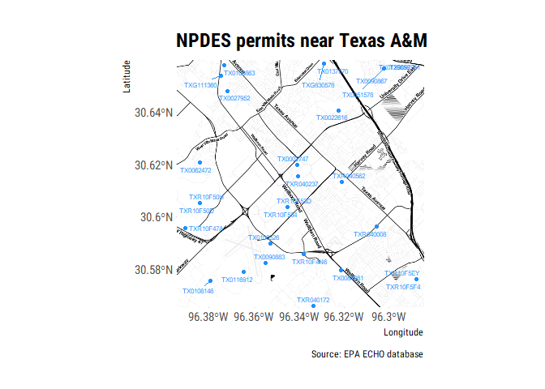

<!-- README.md is generated from README.Rmd. Please edit that file -->
echor
=====

Coming soon ...

Overview
--------

The goal of echor is to download dishcarge and emission data from the EPA ECHO database in a tidy format.

Installation
------------

``` r

devtools::install_github("mps9506/echor")
```

Example
-------

### Download information about facilities with an NPDES permit

We can look up plants by permit id, bounding box, and numerous other parameters. I plan on providing documentation of available parameters. However, arguments can be looked up here: [get\_cwa\_rest\_services\_get\_facility\_info](https://echo.epa.gov/tools/web-services/facility-search-water#!/Facility_Information/get_cwa_rest_services_get_facility_info)

``` r
library(tidyverse)
library(echor)

## echo*GetFacilityInfo() will return a dataframe or simple features (sf) dataframe.

df <- echoWaterGetFacilityInfo(output = "df", 
                               xmin = '-96.387509', 
                               ymin = '30.583572', 
                               xmax = '-96.281422', 
                               ymax = '30.640008')

head(df)
#> # A tibble: 6 x 25
#>   ObjectId CWPName   SourceID CWPStreet  CWPCity CWPState CWPStateDistrict
#>   <chr>    <chr>     <chr>    <chr>      <chr>   <chr>    <lgl>           
#> 1 1        BOSSIER ~ LAG8301~ 3228 BARK~ BENTON  LA       NA              
#> 2 2        BROADSTO~ TXR10F5~ NW OF ATL~ BRYAN   TX       NA              
#> 3 3        BROADSTO~ TXR10F5~ NW OF ATL~ BRYAN   TX       NA              
#> 4 4        CITY OF ~ TXR0400~ WITHIN CI~ COLLEG~ TX       NA              
#> 5 5        HEAT TRA~ TX01065~ 0.25MI SW~ COLLEG~ TX       NA              
#> 6 6        HOLLEMAN~ TXR10F4~ NW OF HOL~ COLLEG~ TX       NA              
#> # ... with 18 more variables: CWPZip <chr>,
#> #   MasterExternalPermitNmbr <chr>, CWPCounty <chr>, CWPEPARegion <chr>,
#> #   FacFederalAgencyCode <lgl>, FacLong <chr>,
#> #   CWPFacilityTypeIndicator <chr>, BioReportingObligations2017 <lgl>,
#> #   StormWaterArea <lgl>, SpeciesCriticalHabitalFlag <lgl>,
#> #   SwpppUrl <lgl>, ExposedActivity <lgl>, AssociatedPollutant <lgl>,
#> #   TypeOfMonitoring <lgl>, TypeOfWater <lgl>, EjscreenFlagUs <chr>,
#> #   PctileProximityNPDESUs <chr>, PctileProximityNplUs <chr>
```

When returned as sf dataframes, the data is suitable for immediate spatial plotting or analysis:

``` r
library(ggmap)
library(sf)
library(ggrepel)
## This example requires the development version of ggplot with support
## for geom_sf()
## and uses theme_ipsum_rc() from library(hrbrthemes)


df <- echoWaterGetFacilityInfo(output = "sp", 
                               xmin = '-96.387509', 
                               ymin = '30.583572', 
                               xmax = '-96.281422', 
                               ymax = '30.640008')

collegestation <- get_map(location = c(-96.387509, 30.583572,
                                       -96.281422, 30.640008), 
                          zoom = 14, maptype = "toner")

##to make labels, need to map the coords and use geom_text :(
## can't help but think there is an easier way to do this

df <- df %>%
  mutate(
    coords = map(geometry, st_coordinates),
    coords_x = map_dbl(coords, 1),
    coords_y = map_dbl(coords, 2)
  )

ggmap(collegestation) + 
  geom_sf(data = df, inherit.aes = FALSE, shape = 21, 
          color = "darkred", fill = "darkred", 
          size = 2, alpha = 0.25) +
  geom_label_repel(data = df, aes(x = coords_x, y = coords_y, label = SourceID),
                   point.padding = .5, min.segment.length = 0.1,
                   size = 2, color = "dodgerblue") +
  theme_ipsum_rc() +
  labs(x = "Longitude", y = "Latitude", 
       title = "NPDES permits near Texas A&M",
       caption = "Source: EPA ECHO database")
```


