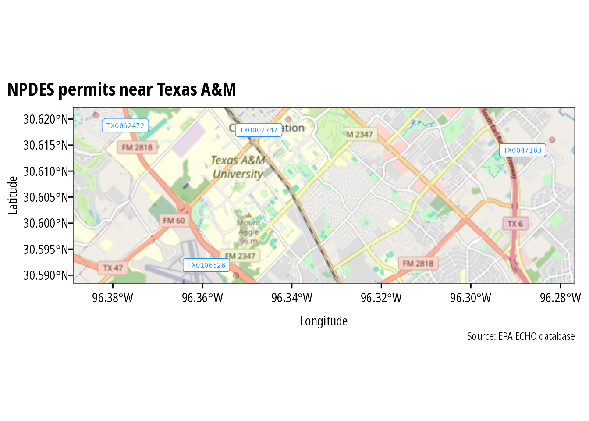
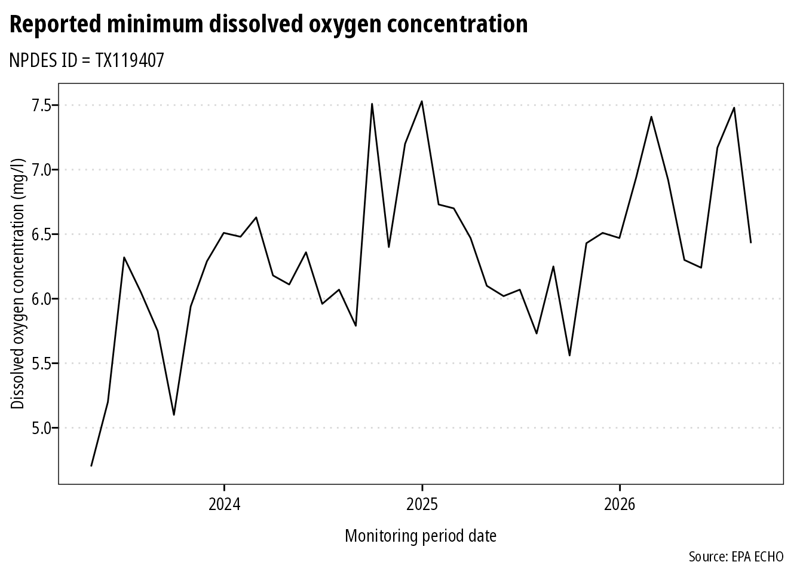

<!-- README.md is generated from README.Rmd. Please edit that file -->

# echor

<!-- badges: start -->

<!-- badges: end -->

## Overview

echor downloads wastewater discharge and air emission data for EPA
permitted facilities using the [EPA ECHO API](https://echo.epa.gov/).

## Installation

echor is on CRAN:

    install.packages("echor")

Or install the development version:

    install.packages('echor', repos = 'https://mps9506.r-universe.dev')

## Usage

[Getting
started](https://mps9506.github.io/echor/articles/introduction.html)

[Functions](https://mps9506.github.io/echor/reference/index.html)

## Examples

### Download information about facilities with an NPDES permit

We can look up plants by permit id, bounding box, and numerous other
parameters. I plan on providing documentation of available parameters.
However, arguments can be looked up here:
[get\_cwa\_rest\_services\_get\_facility\_info](https://echo.epa.gov/tools/web-services/facility-search-water#!/Facility_Information/get_cwa_rest_services_get_facility_info)

    library(echor)

    ## echoWaterGetFacilityInfo() will return a dataframe or simple features (sf) dataframe.

    df <- echoWaterGetFacilityInfo(output = "df", 
                                   p_c1lon = '-96.387509', 
                                   p_c1lat = '30.583572', 
                                   p_c2lon = '-96.281422', 
                                   p_c2lat = '30.640008',
                                   p_ptype = "NPD")

    head(df)
    #> # A tibble: 4 × 26
    #>   CWPName            SourceID CWPStreet CWPCity CWPState CWPStateDistrict CWPZip
    #>   <chr>              <chr>    <chr>     <chr>   <chr>    <chr>            <chr> 
    #> 1 CARTERS CREEK WWTP TX00471… 2200 N F… COLLEG… TX       09               77845 
    #> 2 CENTRAL UTILITY P… TX00027… 1584 TAMU COLLEG… TX       09               77843 
    #> 3 HEAT TRANSFER RES… TX01065… 0.25MI S… COLLEG… TX       09               77845 
    #> 4 TURKEY CREEK WWTP  TX00624… 3000FT W… BRYAN   TX       09               77807 
    #> # ℹ 19 more variables: MasterExternalPermitNmbr <chr>, RegistryID <chr>,
    #> #   EPASystem <chr>, Statute <chr>, FacStdCountyName <chr>,
    #> #   CWPNAICSCodes <chr>, FacLat <dbl>, FacLong <dbl>,
    #> #   CWPTotalDesignFlowNmbr <dbl>, AIRIDs <chr>, FacPopDen <dbl>,
    #> #   CWPTerminationDate <date>, CWPMajorMinorStatusFlag <chr>,
    #> #   NPDESDataGroupsDescs <chr>, CWPInspectionCount <dbl>,
    #> #   CWPDaysLastInspection <dbl>, CWPDateLastInspEPA <date>, …

The ECHO database can provide over 270 different columns. echor returns
a subset of these columns that should work for most users. However, you
can specify what data you want returned. Use `echoWaterGetMeta()` to
return a dataframe with column numbers, names, and descriptions to
identify the columns you want returned. Then include the column numbers
as a comma separated string in the `qcolumns` argument. In the example
below, the `qcolumns` argument indicates the dataframe will include
plant name, 8-digit HUC, latitude, longitude, and total design flow.

    df <- echoWaterGetFacilityInfo(output = "df", 
                                   p_c1lon = '-96.387509', 
                                   p_c1lat = '30.583572', 
                                   p_c2lon = '-96.281422', 
                                   p_c2lat = '30.640008',
                                   qcolumns = '1,14,23,24,25',
                                   p_ptype = "NPD")
    head(df)
    #> # A tibble: 4 × 6
    #>   CWPName                SourceID  FacStdCountyName CWPNAICSCodes FacLat FacLong
    #>   <chr>                  <chr>     <chr>            <chr>          <dbl>   <dbl>
    #> 1 CARTERS CREEK WWTP     TX0047163 BRAZOS COUNTY    <NA>            30.6   -96.3
    #> 2 CENTRAL UTILITY PLANT  TX0002747 BRAZOS COUNTY    <NA>            30.6   -96.3
    #> 3 HEAT TRANSFER RESEARCH TX0106526 BRAZOS COUNTY    <NA>            30.6   -96.4
    #> 4 TURKEY CREEK WWTP      TX0062472 BRAZOS COUNTY    <NA>            30.6   -96.4

When returned as sf dataframes, the data is suitable for immediate
spatial plotting or analysis.

    library(ggspatial)
    library(sf)
    library(ggrepel)
    library(prettymapr)

    df <- echoWaterGetFacilityInfo(output = "sf", 
                                   p_c1lon = '-96.387509', 
                                   p_c1lat = '30.583572', 
                                   p_c2lon = '-96.281422', 
                                   p_c2lat = '30.640008',
                                   p_ptype = "NPD")

    ggplot(df) +
      annotation_map_tile(zoomin = -1, progress = "none") +
      geom_sf(inherit.aes = FALSE, shape = 21, 
              color = "darkred", fill = "darkred", 
              size = 2, alpha = 0.25) +
      geom_label_repel(data = df, aes(label = SourceID,
                                      geometry = geometry),
                       stat = "sf_coordinates",
                       point.padding = .5, min.segment.length = 0.1,
                       size = 2, color = "dodgerblue") +
      theme_mps_noto() +
      labs(x = "Longitude", y = "Latitude", 
           title = "NPDES permits near Texas A&M",
           caption = "Source: EPA ECHO database")

### Download discharge/emissions data

Use `echoGetEffluent()` or `echoGetCAAPR()` to download tidy dataframes
of permitted water discharger Discharge Monitoring Report (DMR) or
permitted emitters Clean Air Act annual emissions reports. Please note
that all variables are returned as *character* vectors.

    df <- echoGetEffluent(p_id = 'tx0119407', parameter_code = '00300')

    df <- df %>%
      mutate(dmr_value_nmbr = as.numeric(dmr_value_nmbr),
             monitoring_period_end_date = as.Date(monitoring_period_end_date,
                                                  "%m/%d/%Y")) %>%
      filter(!is.na(dmr_value_nmbr) & limit_value_type_code == "C1")

    ggplot(df) +
      geom_line(aes(monitoring_period_end_date, dmr_value_nmbr)) +
      theme_mps_noto() +
      labs(x = "Monitoring period date",
           y = "Dissolved oxygen concentration (mg/l)",
           title = "Reported minimum dissolved oxygen concentration",
           subtitle = "NPDES ID = TX119407",
           caption = "Source: EPA ECHO")

## Session Info

    sessioninfo::platform_info()
    #>  setting  value
    #>  version  R version 4.6.1 (2026-06-24)
    #>  os       Ubuntu 24.04.5 LTS
    #>  system   x86_64, linux-gnu
    #>  ui       X11
    #>  language (EN)
    #>  collate  C.UTF-8
    #>  ctype    C.UTF-8
    #>  tz       UTC
    #>  date     2026-09-10
    #>  pandoc   3.8.3 @ /opt/hostedtoolcache/pandoc/3.8.3/x64/ (via rmarkdown)
    #>  quarto   NA
    sessioninfo::package_info()
    #>  ! package      * version    date (UTC) lib source
    #>  P abind          1.4-8      2024-09-12 [?] RSPM
    #>  P bit            4.6.0      2025-03-06 [?] RSPM
    #>  P bit64          4.8.6      2026-09-01 [?] RSPM
    #>  P class          7.3-23     2025-01-01 [?] CRAN (R 4.6.1)
    #>  P classInt       0.4-11     2025-01-08 [?] RSPM
    #>  P cli            3.6.6      2026-04-09 [?] RSPM
    #>  P codetools      0.2-20     2024-03-31 [?] CRAN (R 4.6.1)
    #>  P crayon         1.5.3      2024-06-20 [?] RSPM
    #>  P curl           8.0.0      2026-08-25 [?] RSPM
    #>  P DBI            1.3.0      2026-02-25 [?] RSPM
    #>  P digest         0.6.39     2025-11-19 [?] RSPM
    #>  P dplyr        * 1.2.1      2026-04-03 [?] RSPM
    #>  P e1071          1.7-17     2025-12-18 [?] RSPM
    #>    echor        * 0.1.9.9999 2026-09-10 [1] local
    #>  P evaluate       1.0.5      2025-08-27 [?] RSPM
    #>  P farver         2.1.2      2024-05-13 [?] RSPM
    #>  P fastmap        1.2.0      2024-05-15 [?] RSPM
    #>  P fs             2.1.0      2026-04-18 [?] RSPM
    #>  P generics       0.1.4      2025-05-09 [?] RSPM
    #>  P ggplot2      * 4.0.3      2026-04-22 [?] RSPM
    #>  P ggrepel      * 0.9.8      2026-03-17 [?] RSPM
    #>  P ggspatial    * 1.1.10     2025-08-24 [?] RSPM
    #>  P glue           1.8.1      2026-04-17 [?] RSPM
    #>  P gtable         0.3.6      2024-10-25 [?] RSPM
    #>  P hms            1.1.4      2025-10-17 [?] RSPM
    #>  P htmltools      0.5.9      2025-12-04 [?] RSPM
    #>  P httr           1.4.9      2026-09-01 [?] RSPM
    #>  P jsonlite       2.0.0      2025-03-27 [?] RSPM
    #>  P KernSmooth     2.23-26    2025-01-01 [?] CRAN (R 4.6.1)
    #>  P knitr          1.52       2026-09-06 [?] RSPM
    #>  P labeling       0.4.3      2023-08-29 [?] RSPM
    #>  P lattice        0.22-9     2026-02-09 [?] CRAN (R 4.6.1)
    #>  P lifecycle      1.0.5      2026-01-08 [?] RSPM
    #>  P magrittr       2.0.5      2026-04-04 [?] RSPM
    #>  P mpsTemplates * 0.2.0      2026-09-10 [?] Github (mps9506/mpsTemplates@d7a070e)
    #>  P otel           0.2.0      2025-08-29 [?] RSPM
    #>  P pillar         1.11.1     2025-09-17 [?] RSPM
    #>  P pkgconfig      2.0.3      2019-09-22 [?] RSPM
    #>  P plyr           1.8.9      2023-10-02 [?] RSPM
    #>  P png            0.1-9      2026-03-15 [?] RSPM
    #>  P prettymapr   * 0.2.5      2024-02-23 [?] RSPM
    #>  P prettyunits    1.2.0      2023-09-24 [?] RSPM
    #>  P progress       1.2.3      2023-12-06 [?] RSPM
    #>  P proxy          0.4-29     2025-12-29 [?] RSPM
    #>  P purrr          1.2.2      2026-04-10 [?] RSPM
    #>  P R6             2.6.1      2025-02-15 [?] RSPM
    #>  P ragg         * 1.5.2      2026-03-23 [?] RSPM
    #>    raster         3.6-32     2025-03-28 [1] CRAN (R 4.6.1)
    #>  P RColorBrewer   1.1-3      2022-04-03 [?] RSPM
    #>  P Rcpp           1.1.2      2026-07-05 [?] RSPM
    #>  P readr          2.2.0      2026-02-19 [?] RSPM
    #>    renv           1.2.4      2026-08-03 [1] RSPM (R 4.6.0)
    #>  P rlang          1.3.0      2026-07-05 [?] RSPM
    #>  P rmarkdown      2.32       2026-09-01 [?] RSPM
    #>  P rosm           0.3.2      2026-09-02 [?] RSPM
    #>  P S7             0.2.2      2026-04-22 [?] RSPM
    #>  P scales         1.4.0      2025-04-24 [?] RSPM
    #>  P sessioninfo    1.2.4      2026-06-04 [?] RSPM
    #>  P sf           * 1.1-2      2026-07-23 [?] RSPM
    #>    sp             2.2-3      2026-07-19 [1] CRAN (R 4.6.1)
    #>  P systemfonts    1.3.2      2026-03-05 [?] RSPM
    #>    terra          1.9-50     2026-09-08 [1] CRAN (R 4.6.1)
    #>  P textshaping    1.0.5      2026-03-06 [?] RSPM
    #>  P tibble         3.3.1      2026-01-11 [?] RSPM
    #>  P tidyr          1.3.2      2025-12-19 [?] RSPM
    #>  P tidyselect     1.2.1      2024-03-11 [?] RSPM
    #>  P tzdb           0.5.0      2025-03-15 [?] RSPM
    #>  P units          1.0-1      2026-03-11 [?] RSPM
    #>  P utf8           1.2.6      2025-06-08 [?] RSPM
    #>  P vctrs          0.7.3      2026-04-11 [?] RSPM
    #>  P vroom          1.7.1      2026-03-31 [?] RSPM
    #>  P withr          3.0.3      2026-06-19 [?] RSPM
    #>  P xfun           0.60       2026-07-09 [?] RSPM
    #>  P yaml           2.3.12     2025-12-10 [?] RSPM
    #> 
    #>  [1] /home/runner/.cache/R/renv/library/echor-4ec080d0/linux-ubuntu-noble/R-4.6/x86_64-pc-linux-gnu
    #>  [2] /home/runner/.cache/R/renv/sandbox/linux-ubuntu-noble/R-4.6/x86_64-pc-linux-gnu/e7c0fad7
    #> 
    #>  * ── Packages attached to the search path.
    #>  P ── Loaded and on-disk path mismatch.
