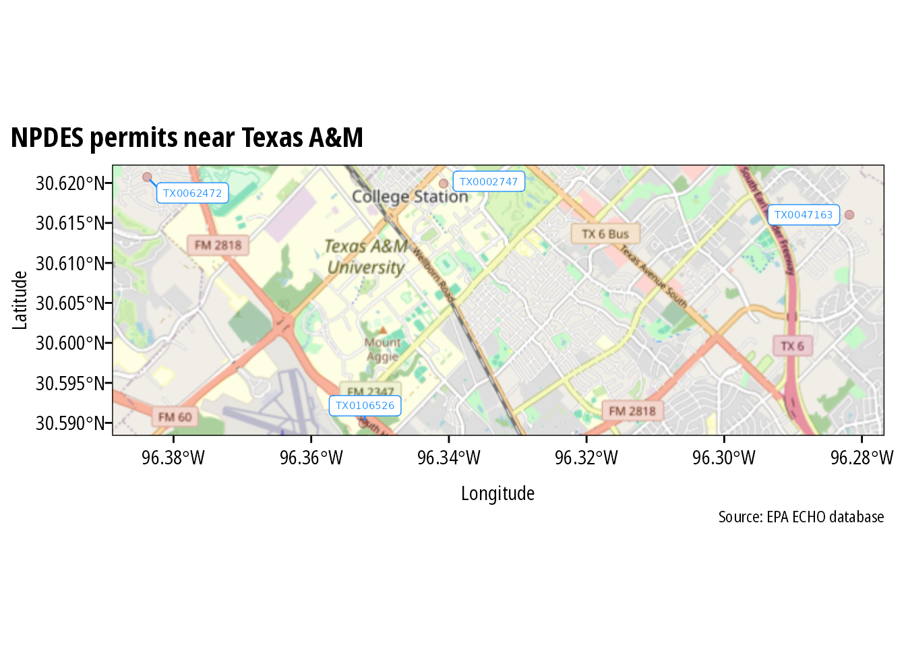
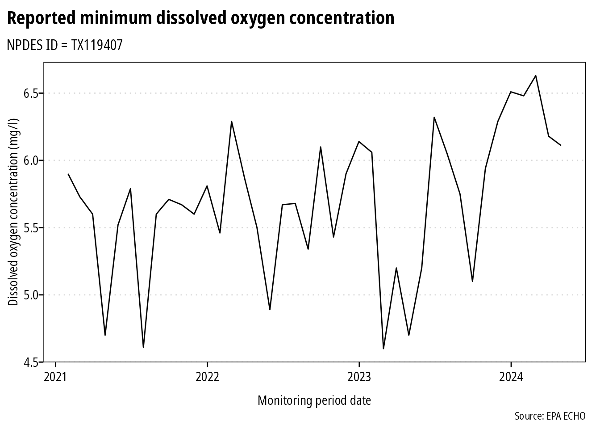

<!-- README.md is generated from README.Rmd. Please edit that file -->

echor
=====

<!-- badges: start -->

<!-- badges: end -->

Overview
--------

echor downloads wastewater discharge and air emission data for EPA
permitted facilities using the [EPA ECHO API](https://echo.epa.gov/).

Installation
------------

echor is on CRAN:

    install.packages("echor")

Or install the development version from github:

    remotes::install_github("mps9506/echor")

Usage
-----

[Getting
started](https://mps9506.github.io/echor/articles/introduction.html)

[Functions](https://mps9506.github.io/echor/reference/index.html)

Examples
--------

### Download information about facilities with an NPDES permit

We can look up plants by permit id, bounding box, and numerous other
parameters. I plan on providing documentation of available parameters.
However, arguments can be looked up here:
[get\_cwa\_rest\_services\_get\_facility\_info](https://echo.epa.gov/tools/web-services/facility-search-water#!/Facility_Information/get_cwa_rest_services_get_facility_info)

    library(echor)

    ## echoWaterGetFacilityInfo() will return a dataframe or simple features (sf) dataframe.

    df <- echoWaterGetFacilityInfo(output = "df", 
                                   xmin = '-96.387509', 
                                   ymin = '30.583572', 
                                   xmax = '-96.281422', 
                                   ymax = '30.640008',
                                   p_ptype = "NPD")

    head(df)
    #> # A tibble: 4 × 26
    #>   CWPName    SourceID  CWPStreet       CWPCity  CWPState CWPStateDistrict CWPZip
    #>   <chr>      <chr>     <chr>           <chr>    <chr>    <chr>            <chr> 
    #> 1 CARTER CR… TX0047163 2200 NORTH FOR… COLLEGE… TX       09               77845 
    #> 2 CENTRAL U… TX0002747 222 IRELAND ST  COLLEGE… TX       09               77843 
    #> 3 HEAT TRAN… TX0106526 0.25MI SW INTX… COLLEGE… TX       09               77845 
    #> 4 TURKEY CR… TX0062472 3000FT W FMR 2… BRYAN    TX       09               77807 
    #> # … with 19 more variables: MasterExternalPermitNmbr <chr>, RegistryID <chr>,
    #> #   CWPCounty <chr>, CWPEPARegion <chr>, FacDerivedHuc <chr>, FacLat <dbl>,
    #> #   FacLong <dbl>, CWPTotalDesignFlowNmbr <dbl>,
    #> #   CWPActualAverageFlowNmbr <dbl>, ReceivingMs4Name <chr>,
    #> #   AssociatedPollutant <chr>, MsgpPermitType <chr>, CWPPermitStatusDesc <chr>,
    #> #   CWPPermitTypeDesc <chr>, CWPIssueDate <date>, CWPEffectiveDate <date>,
    #> #   CWPExpirationDate <date>, CWPSNCStatusDate <date>, …

The ECHO database can provide over 270 different columns. echor returns
a subset of these columns that should work for most users. However, you
can specify what data you want returned. Use `echoWaterGetMeta()` to
return a dataframe with column numbers, names, and descriptions to
identify the columns you want returned. Then include the column numbers
as a comma separated string in the `qcolumns` argument. In the example
below, the `qcolumns` argument indicates the dataframe will include
plant name, 8-digit HUC, latitude, longitude, and total design flow.

    df <- echoWaterGetFacilityInfo(output = "df", 
                                   xmin = '-96.387509', 
                                   ymin = '30.583572', 
                                   xmax = '-96.281422', 
                                   ymax = '30.640008',
                                   qcolumns = '1,14,23,24,25',
                                   p_ptype = "NPD")
    head(df)
    #> # A tibble: 4 × 6
    #>   CWPName                SourceID  FacDerivedHuc FacLat FacLong CWPTotalDesignF…
    #>   <chr>                  <chr>     <chr>          <dbl>   <dbl>            <dbl>
    #> 1 CARTER CREEK WWTP      TX0047163 "12070103"      30.6   -96.3             9.5 
    #> 2 CENTRAL UTILITY PLANT  TX0002747 "12070103"      30.6   -96.3             0.93
    #> 3 HEAT TRANSFER RESEARCH TX0106526 ""              30.6   -96.4            NA   
    #> 4 TURKEY CREEK WWTP      TX0062472 "12070101"      30.6   -96.4             0.75

When returned as sf dataframes, the data is suitable for immediate
spatial plotting or analysis:

    library(ggspatial)
    library(sf)
    library(ggrepel)
    library(purrr)
    ## This example requires the development version of ggplot with support
    ## for geom_sf()
    ## and uses theme_ipsum_rc() from library(hrbrthemes)

    df <- echoWaterGetFacilityInfo(output = "sf", 
                                   xmin = '-96.387509', 
                                   ymin = '30.583572', 
                                   xmax = '-96.281422', 
                                   ymax = '30.640008',
                                   p_ptype = "NPD")

    ##to make labels, need to map the coords and use geom_text :(
    ## can't help but think there is an easier way to do this

    df <- df %>%
      mutate(
        coords = map(geometry, st_coordinates),
        coords_x = map_dbl(coords, 1),
        coords_y = map_dbl(coords, 2)
      )

    ggplot(df) +
      annotation_map_tile(zoomin = -1, progress = "none") +
      geom_sf(inherit.aes = FALSE, shape = 21, 
              color = "darkred", fill = "darkred", 
              size = 2, alpha = 0.25) +
      geom_label_repel(data = df, aes(x = coords_x, y = coords_y, label = SourceID),
                       point.padding = .5, min.segment.length = 0.1,
                       size = 2, color = "dodgerblue") +
      theme_ipsum(plot_margin = margin(5, 5, 5, 5)) +
      labs(x = "Longitude", y = "Latitude", 
           title = "NPDES permits near Texas A&M",
           caption = "Source: EPA ECHO database")

### Download discharge/emissions data

Use `echoGetEffluent()` or `echoGetCAAPR()` to download tidy dataframes
of permitted water discharger Discharge Monitoring Report (DMR) or
permitted emitters Clean Air Act annual emissions reports. Please note
that all variables are returned as *character* vectors.

    df <- echoGetEffluent(p_id = 'tx0119407', parameter_code = '00300')

    df <- df %>%
      mutate(dmr_value_nmbr = as.numeric(dmr_value_nmbr),
             monitoring_period_end_date = as.Date(monitoring_period_end_date,
                                                  "%m/%d/%Y")) %>%
      filter(!is.na(dmr_value_nmbr) & limit_value_type_code == "C1")

    ggplot(df) +
      geom_line(aes(monitoring_period_end_date, dmr_value_nmbr)) +
      theme_ipsum(grid = "Y") +
      labs(x = "Monitoring period date",
           y = "Dissolved oxygen concentration (mg/l)",
           title = "Reported minimum dissolved oxygen concentration",
           subtitle = "NPDES ID = TX119407",
           caption = "Source: EPA ECHO")

Session Info
------------

    sessioninfo::platform_info()
    #>  setting  value                       
    #>  version  R version 4.1.1 (2021-08-10)
    #>  os       Ubuntu 20.04.2 LTS          
    #>  system   x86_64, linux-gnu           
    #>  ui       X11                         
    #>  language (EN)                        
    #>  collate  C.UTF-8                     
    #>  ctype    C.UTF-8                     
    #>  tz       UTC                         
    #>  date     2021-08-21
    sessioninfo::package_info()
    #>  package     * version date       lib source        
    #>  abind         1.4-5   2016-07-21 [1] CRAN (R 4.1.1)
    #>  bit           4.0.4   2020-08-04 [1] CRAN (R 4.1.1)
    #>  bit64         4.0.5   2020-08-30 [1] CRAN (R 4.1.1)
    #>  class         7.3-19  2021-05-03 [2] CRAN (R 4.1.1)
    #>  classInt      0.4-3   2020-04-07 [1] CRAN (R 4.1.1)
    #>  cli           3.0.1   2021-07-17 [1] CRAN (R 4.1.1)
    #>  codetools     0.2-18  2020-11-04 [2] CRAN (R 4.1.1)
    #>  colorspace    2.0-2   2021-06-24 [1] CRAN (R 4.1.1)
    #>  crayon        1.4.1   2021-02-08 [1] CRAN (R 4.1.1)
    #>  curl          4.3.2   2021-06-23 [1] CRAN (R 4.1.1)
    #>  DBI           1.1.1   2021-01-15 [1] CRAN (R 4.1.1)
    #>  digest        0.6.27  2020-10-24 [1] CRAN (R 4.1.1)
    #>  dplyr       * 1.0.7   2021-06-18 [1] CRAN (R 4.1.1)
    #>  e1071         1.7-8   2021-07-28 [1] CRAN (R 4.1.1)
    #>  echor       * 0.1.5   2020-08-05 [1] CRAN (R 4.1.1)
    #>  ellipsis      0.3.2   2021-04-29 [1] CRAN (R 4.1.1)
    #>  evaluate      0.14    2019-05-28 [1] CRAN (R 4.1.1)
    #>  extrafont   * 0.17    2014-12-08 [1] CRAN (R 4.1.1)
    #>  extrafontdb   1.0     2012-06-11 [1] CRAN (R 4.1.1)
    #>  fansi         0.5.0   2021-05-25 [1] CRAN (R 4.1.1)
    #>  farver        2.1.0   2021-02-28 [1] CRAN (R 4.1.1)
    #>  gdtools       0.2.3   2021-01-06 [1] CRAN (R 4.1.1)
    #>  generics      0.1.0   2020-10-31 [1] CRAN (R 4.1.1)
    #>  geojsonsf     2.0.1   2020-10-02 [1] CRAN (R 4.1.1)
    #>  ggplot2     * 3.3.5   2021-06-25 [1] CRAN (R 4.1.1)
    #>  ggrepel     * 0.9.1   2021-01-15 [1] CRAN (R 4.1.1)
    #>  ggspatial   * 1.1.5   2021-01-04 [1] CRAN (R 4.1.1)
    #>  glue          1.4.2   2020-08-27 [1] CRAN (R 4.1.1)
    #>  gtable        0.3.0   2019-03-25 [1] CRAN (R 4.1.1)
    #>  highr         0.9     2021-04-16 [1] CRAN (R 4.1.1)
    #>  hms           1.1.0   2021-05-17 [1] CRAN (R 4.1.1)
    #>  hrbrthemes  * 0.8.0   2020-03-06 [1] CRAN (R 4.1.1)
    #>  htmltools     0.5.1.1 2021-01-22 [1] CRAN (R 4.1.1)
    #>  httr          1.4.2   2020-07-20 [1] CRAN (R 4.1.1)
    #>  jsonlite      1.7.2   2020-12-09 [1] CRAN (R 4.1.1)
    #>  KernSmooth    2.23-20 2021-05-03 [2] CRAN (R 4.1.1)
    #>  knitr         1.33    2021-04-24 [1] CRAN (R 4.1.1)
    #>  labeling      0.4.2   2020-10-20 [1] CRAN (R 4.1.1)
    #>  lattice       0.20-44 2021-05-02 [2] CRAN (R 4.1.1)
    #>  lifecycle     1.0.0   2021-02-15 [1] CRAN (R 4.1.1)
    #>  magrittr      2.0.1   2020-11-17 [1] CRAN (R 4.1.1)
    #>  munsell       0.5.0   2018-06-12 [1] CRAN (R 4.1.1)
    #>  pillar        1.6.2   2021-07-29 [1] CRAN (R 4.1.1)
    #>  pkgconfig     2.0.3   2019-09-22 [1] CRAN (R 4.1.1)
    #>  plyr          1.8.6   2020-03-03 [1] CRAN (R 4.1.1)
    #>  png           0.1-7   2013-12-03 [1] CRAN (R 4.1.1)
    #>  prettymapr    0.2.2   2017-09-20 [1] CRAN (R 4.1.1)
    #>  proxy         0.4-26  2021-06-07 [1] CRAN (R 4.1.1)
    #>  purrr       * 0.3.4   2020-04-17 [1] CRAN (R 4.1.1)
    #>  R6            2.5.1   2021-08-19 [1] CRAN (R 4.1.1)
    #>  raster        3.4-13  2021-06-18 [1] CRAN (R 4.1.1)
    #>  Rcpp          1.0.7   2021-07-07 [1] CRAN (R 4.1.1)
    #>  readr         2.0.1   2021-08-10 [1] CRAN (R 4.1.1)
    #>  rgdal         1.5-23  2021-02-03 [1] CRAN (R 4.1.1)
    #>  rlang         0.4.11  2021-04-30 [1] CRAN (R 4.1.1)
    #>  rmarkdown     2.10    2021-08-06 [1] CRAN (R 4.1.1)
    #>  rosm          0.2.5   2019-07-22 [1] CRAN (R 4.1.1)
    #>  Rttf2pt1      1.3.9   2021-07-22 [1] CRAN (R 4.1.1)
    #>  s2            1.0.6   2021-06-17 [1] CRAN (R 4.1.1)
    #>  scales        1.1.1   2020-05-11 [1] CRAN (R 4.1.1)
    #>  sessioninfo   1.1.1   2018-11-05 [1] CRAN (R 4.1.1)
    #>  sf          * 1.0-2   2021-07-26 [1] CRAN (R 4.1.1)
    #>  sp            1.4-5   2021-01-10 [1] CRAN (R 4.1.1)
    #>  stringi       1.7.3   2021-07-16 [1] CRAN (R 4.1.1)
    #>  stringr       1.4.0   2019-02-10 [1] CRAN (R 4.1.1)
    #>  systemfonts   1.0.2   2021-05-11 [1] CRAN (R 4.1.1)
    #>  tibble        3.1.3   2021-07-23 [1] CRAN (R 4.1.1)
    #>  tidyr         1.1.3   2021-03-03 [1] CRAN (R 4.1.1)
    #>  tidyselect    1.1.1   2021-04-30 [1] CRAN (R 4.1.1)
    #>  tzdb          0.1.2   2021-07-20 [1] CRAN (R 4.1.1)
    #>  units         0.7-2   2021-06-08 [1] CRAN (R 4.1.1)
    #>  utf8          1.2.2   2021-07-24 [1] CRAN (R 4.1.1)
    #>  vctrs         0.3.8   2021-04-29 [1] CRAN (R 4.1.1)
    #>  vroom         1.5.4   2021-08-05 [1] CRAN (R 4.1.1)
    #>  withr         2.4.2   2021-04-18 [1] CRAN (R 4.1.1)
    #>  wk            0.5.0   2021-07-13 [1] CRAN (R 4.1.1)
    #>  xfun          0.25    2021-08-06 [1] CRAN (R 4.1.1)
    #>  yaml          2.2.1   2020-02-01 [1] CRAN (R 4.1.1)
    #> 
    #> [1] /home/runner/work/_temp/Library
    #> [2] /opt/R/4.1.1/lib/R/library
