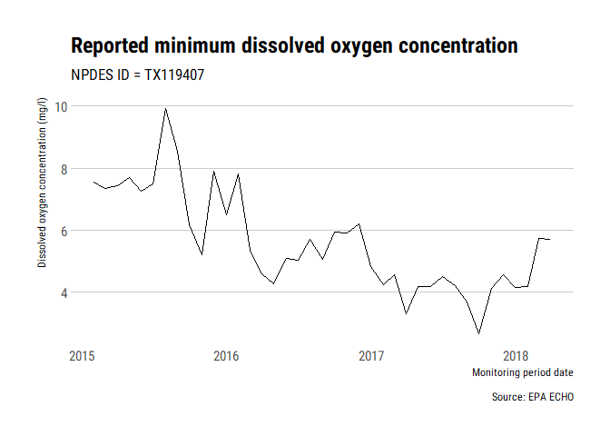

<!-- README.md is generated from README.Rmd. Please edit that file -->
echor
=====

[](https://cran.r-project.org/package=echor)

[](https://travis-ci.org/mps9506/echor)
[](https://ci.appveyor.com/project/mps9506/echor)
[](https://codecov.io/github/mps9506/echor?branch=master)

Overview
--------

echor downloads wastewater discharge and air emission data for EPA
permitted facilities using the [EPA ECHO API](https://echo.epa.gov/).

Installation
------------

Install from CRAN:

``` r
install.packages("echor")
```

Or install the development version from github:

``` r

devtools::install_github("mps9506/echor")
```

Usage
-----

[Getting
started](https://mps9506.github.io/echor/articles/introduction.html)

[Functions](https://mps9506.github.io/echor/reference/index.html)

Examples
--------

### Download information about facilities with an NPDES permit

We can look up plants by permit id, bounding box, and numerous other
parameters. I plan on providing documentation of available parameters.
However, arguments can be looked up here:
[get\_cwa\_rest\_services\_get\_facility\_info](https://echo.epa.gov/tools/web-services/facility-search-water#!/Facility_Information/get_cwa_rest_services_get_facility_info)

``` r
library(tidyverse)
library(echor)

## echo*GetFacilityInfo() will return a dataframe or simple features (sf) dataframe.

df <- echoWaterGetFacilityInfo(output = "df", 
                               xmin = '-96.387509', 
                               ymin = '30.583572', 
                               xmax = '-96.281422', 
                               ymax = '30.640008')

head(df)
#> # A tibble: 6 x 25
#>   ObjectId CWPName   SourceID CWPStreet  CWPCity CWPState CWPStateDistrict
#>   <chr>    <chr>     <chr>    <chr>      <chr>   <chr>    <lgl>           
#> 1 1        BOSSIER ~ LAG8301~ 3228 BARK~ BENTON  LA       NA              
#> 2 2        BROADSTO~ TXR10F5~ NW OF ATL~ BRYAN   TX       NA              
#> 3 3        BROADSTO~ TXR10F5~ NW OF ATL~ BRYAN   TX       NA              
#> 4 4        CITY OF ~ TXR0400~ WITHIN CI~ COLLEG~ TX       NA              
#> 5 5        HEAT TRA~ TX01065~ 0.25MI SW~ COLLEG~ TX       NA              
#> 6 6        HOLLEMAN~ TXR10F4~ NW OF HOL~ COLLEG~ TX       NA              
#> # ... with 18 more variables: CWPZip <chr>,
#> #   MasterExternalPermitNmbr <chr>, CWPCounty <chr>, CWPEPARegion <chr>,
#> #   FacFederalAgencyCode <lgl>, FacLong <chr>,
#> #   CWPFacilityTypeIndicator <chr>, ReceivingMs4Name <lgl>,
#> #   SpeciesCriticalHabitalFlag <lgl>, ExposedActivity <lgl>,
#> #   AssociatedPollutant <lgl>, ControlMeasure <lgl>,
#> #   ControlMeasureSchedule <lgl>, EjscreenFlagUs <chr>,
#> #   Over80CountUs <chr>, PctilePctpre1960Us <chr>,
#> #   PctileProximityRmpUs <chr>, PctileProximityTsdfUs <chr>
```

When returned as sf dataframes, the data is suitable for immediate
spatial plotting or analysis:

``` r
library(ggmap)
library(sf)
library(ggrepel)
## This example requires the development version of ggplot with support
## for geom_sf()
## and uses theme_ipsum_rc() from library(hrbrthemes)


df <- echoWaterGetFacilityInfo(output = "sf", 
                               xmin = '-96.387509', 
                               ymin = '30.583572', 
                               xmax = '-96.281422', 
                               ymax = '30.640008')

collegestation <- get_map(location = c(-96.387509, 30.583572,
                                       -96.281422, 30.640008), 
                          zoom = 14, maptype = "toner")

##to make labels, need to map the coords and use geom_text :(
## can't help but think there is an easier way to do this

df <- df %>%
  mutate(
    coords = map(geometry, st_coordinates),
    coords_x = map_dbl(coords, 1),
    coords_y = map_dbl(coords, 2)
  )

ggmap(collegestation) + 
  geom_sf(data = df, inherit.aes = FALSE, shape = 21, 
          color = "darkred", fill = "darkred", 
          size = 2, alpha = 0.25) +
  geom_label_repel(data = df, aes(x = coords_x, y = coords_y, label = SourceID),
                   point.padding = .5, min.segment.length = 0.1,
                   size = 2, color = "dodgerblue") +
  theme_ipsum_rc() +
  labs(x = "Longitude", y = "Latitude", 
       title = "NPDES permits near Texas A&M",
       caption = "Source: EPA ECHO database")
```


### Download discharge/emissions data

Use `echoGetEffluent()` or `echoGetCAAPR()` to download tidy dataframes
of permitted water discharger Discharge Monitoring Report (DMR) or
permitted emitters Clean Air Act annual emissions reports.

``` r
df <- echoGetEffluent(p_id = 'tx0119407', parameter_code = '00300')

df <- df %>%
  filter(!is.na(DMRValueNmbr) & ValueTypeCode == "C1")

ggplot(df) +
  geom_line(aes(MonitoringPeriodEndDate, DMRValueNmbr)) +
  theme_ipsum_rc(grid = "Y") +
  labs(x = "Monitoring period date",
       y = "Dissolved oxygen concentration (mg/l)",
       title = "Reported minimum dissolved oxygen concentration",
       subtitle = "NPDES ID = TX119407",
       caption = "Source: EPA ECHO")
```


