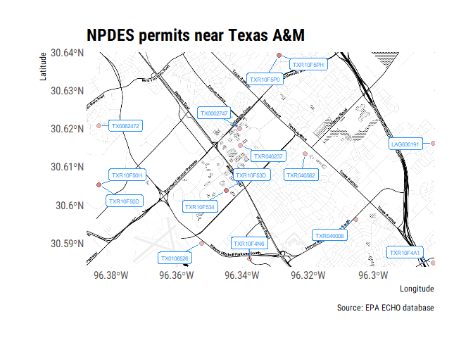

<!-- README.md is generated from README.Rmd. Please edit that file -->
    ## -- Attaching packages --------------------------------------------------------------------------------- tidyverse 1.2.1 --

    ## v ggplot2 2.2.1.9000     v purrr   0.2.4     
    ## v tibble  1.4.2          v dplyr   0.7.4     
    ## v tidyr   0.7.2          v stringr 1.2.0     
    ## v readr   1.1.1          v forcats 0.2.0

    ## -- Conflicts ------------------------------------------------------------------------------------ tidyverse_conflicts() --
    ## x dplyr::filter() masks stats::filter()
    ## x dplyr::lag()    masks stats::lag()

    ## More than one version of regular/bold/italic found for Roboto Condensed. Skipping setup for this font.

echor
=====

Coming soon ...

Overview
--------

The goal of echor is to download dishcarge and emission data from the EPA ECHO database in a tidy format.

Installation
------------

``` r

devtools::install_github("mps9506/echor")
```

Example
-------

### Download information about facilities with an NPDES permit

We can look up plants by permit id, bounding box, and numerous other parameters. I plan on providing documentation of available parameters. However, arguments can be looked up here: [get\_cwa\_rest\_services\_get\_facility\_info](https://echo.epa.gov/tools/web-services/facility-search-water#!/Facility_Information/get_cwa_rest_services_get_facility_info)

``` r
library(tidyverse)
library(echor)
df <- echoWaterGetFacilityInfo(output = "df", xmin = '-96.407563',
                               ymin = '30.554395', xmax = '-96.25947',
                               ymax = '30.751984')

head(df)
```

This can be retrieved as a geojson and plotted as well:

``` r
library(ggmap)
library(sf)
library(ggrepel)

df <- echoWaterGetFacilityInfo(output = "sp", 
                               xmin = '-96.387509', 
                               ymin = '30.583572', 
                               xmax = '-96.281422', 
                               ymax = '30.640008')

collegestation <- get_map(location = c(-96.387509, 30.583572,
                                       -96.281422, 30.640008), 
                          zoom = 14, maptype = "toner")

##to make labels, need to map the coords and use geom_text :(
## can't help but think there is an easier way to do this

df <- df %>%
  mutate(
    coords = map(geometry, st_coordinates),
    coords_x = map_dbl(coords, 1),
    coords_y = map_dbl(coords, 2)
  )

ggmap(collegestation) + 
  geom_sf(data = df, inherit.aes = FALSE, shape = 21, 
          color = "darkred", fill = "darkred", 
          size = 2, alpha = 0.25) +
  geom_label_repel(data = df, aes(x = coords_x, y = coords_y, label = SourceID),
                   point.padding = .5, min.segment.length = 0.1,
                   size = 2, color = "dodgerblue") +
  theme_ipsum_rc() +
  labs(x = "Longitude", y = "Latitude", 
       title = "NPDES permits near Texas A&M",
       caption = "Source: EPA ECHO database")
```


