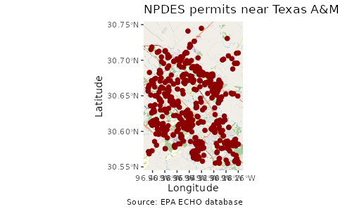

# Spatial echor Data

`echor` can also return spatial data frames known as simple features
(<https://r-spatial.github.io/sf/>), to facilitate creation of maps.
Both `echoAirGetFacilityInfo` and `echoWaterGetFacilityInfo` include
arguments to return simple feature dataframes.

Using `sf`, `ggplot`, and `ggspatial` we can quickly create a map of
downloaded data.

``` r


library(echor)
library(ggplot2)
library(ggspatial)
library(dplyr)
library(sf)

## Download data as a simple feature
df <- echoWaterGetFacilityInfo(p_c1lon = '-96.407563', p_c1lat = '30.554395',
                               p_c2lon = '-96.25947', p_c2lat = '30.751984',
                               output = 'sf')

## Make the map
ggplot(df) +
  annotation_map_tile(zoomin = 0, progress = "none") +
  geom_sf(inherit.aes = FALSE, shape = 21, 
          color = "darkred", fill = "darkred", 
          size = 2) +
  labs(x = "Longitude", y = "Latitude", 
       title = "NPDES permits near Texas A&M",
       caption = "Source: EPA ECHO database")
```


